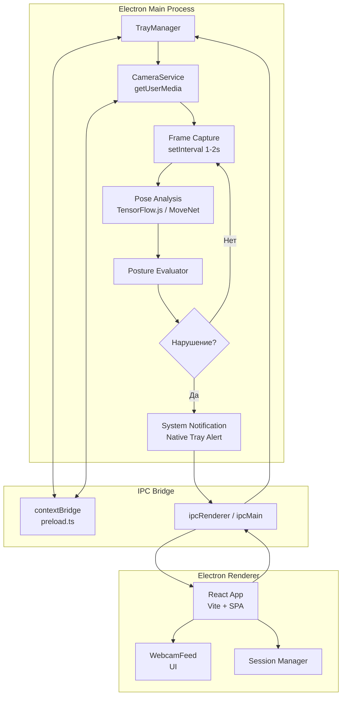
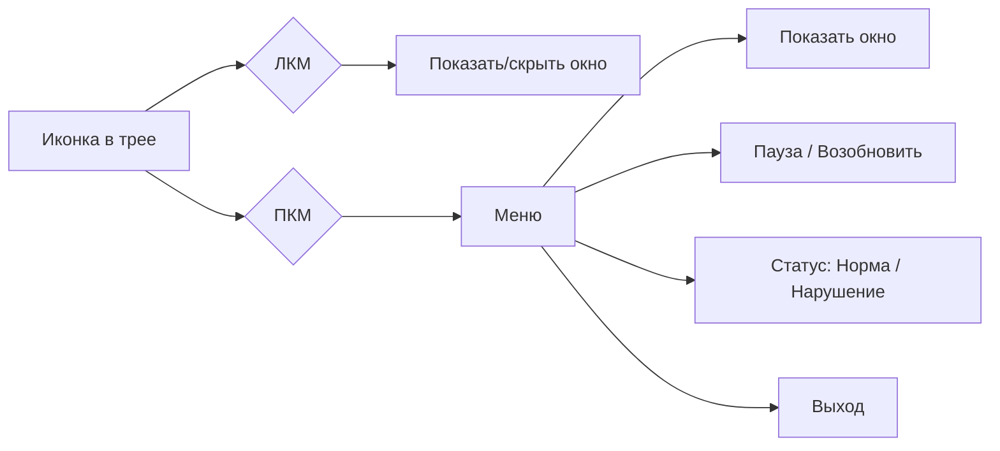
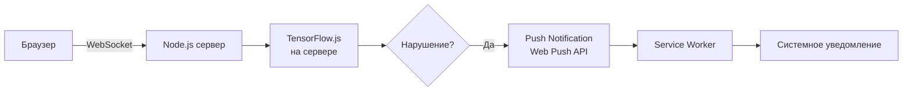

# Архитектура фонового анализа осанки — версия 2.0

## Почему фронтенд-решения не работают

После глубокого анализа выяснилось, что **ни один фронтенд-подход не может гарантировать работу в фоне**:

| Техника | Проблема |
|---------|----------|
| `setInterval` | Chrome throttle'ит до 1 раза в минуту в background |
| `requestAnimationFrame` | Полностью останавливается в background |
| Web Worker `setInterval` | Chrome throttle'ит и workers в background |
| `ImageCapture.grabFrame()` | Тоже throttle'ится, т.к. зависит от главного потока |
| `<video>` в DOM | Браузер приостанавливает декодирование |
| `AudioContext` timer | Chrome throttle'ит и AudioContext |

**Это сознательное ограничение браузеров** — они экономят батарею и CPU пользователя. Обойти его невозможно.

## Решение: Electron + Native модули

Единственный надёжный способ — **Electron-приложение**, которое работает как нативное десктопное приложение и не подвержено браузерным ограничениям.



### Как это работает

1. **Main Process** (Node.js) — не throttle'ится, работает всегда
   - Захватывает кадры с камеры через `navigator.mediaDevices.getUserMedia` (доступен в Electron)
   - Запускает TensorFlow.js/MoveNet анализ
   - Показывает системные уведомления через `Notification` API Electron
   - Управляет иконкой в системном трее

2. **Renderer Process** (React SPA) — обычное веб-приложение
   - Показывает UI, превью камеры, статистику
   - При закрытии окна — приложение не закрывается, а сворачивается в трей

3. **IPC Bridge** — связь между процессами
   - Renderer → Main: start/stop/calibrate
   - Main → Renderer: status/notifications/metrics

### Файловая структура

```
posture_analizer1/
├── electron/                    # Новая папка
│   ├── main.ts                  # Главный процесс Electron
│   ├── preload.ts               # preload-скрипт (contextBridge)
│   ├── services/
│   │   ├── cameraService.ts     # Управление камерой
│   │   ├── poseService.ts       # TensorFlow.js анализ
│   │   └── notificationService.ts # Системные уведомления
│   └── tsconfig.json
├── frontend/                    # React SPA (Renderer)
│   └── ...                      # Без изменений
├── package.json                 # Корневой package.json для Electron
└── electron-builder.yml         # Конфиг сборки
```

### Что меняется во фронтенде

Фронтенд остаётся почти без изменений. Единственное отличие:
- Вместо `PostureAnalysisService` (singleton) — данные приходят через IPC из main process
- `PostureAnalysisContext` получает статус через `window.electronAPI.onStatus()`
- Управление (start/stop/calibrate) — через `window.electronAPI.control()`

### Системный трей



### Уведомления

- **Native Notification** — показываются системой, работают даже когда окно скрыто
- **Tray Balloon** — всплывающее уведомление от иконки в трее
- **Звуковой сигнал** — через main process (не throttle'ится)

### Что нужно установить

```bash
npm install electron electron-builder --save-dev
# В корне проекта
```

### План реализации

| Шаг | Что делаем | Файлы |
|-----|-----------|-------|
| 1 | Создать корневой `package.json` с Electron | `package.json` |
| 2 | Написать `electron/main.ts` — главный процесс | `electron/main.ts` |
| 3 | Написать `electron/preload.ts` — IPC bridge | `electron/preload.ts` |
| 4 | Создать `cameraService.ts` — захват кадров | `electron/services/cameraService.ts` |
| 5 | Создать `poseService.ts` — TensorFlow.js анализ | `electron/services/poseService.ts` |
| 6 | Создать `notificationService.ts` — уведомления | `electron/services/notificationService.ts` |
| 7 | Обновить `vite.config.ts` — сборка для Electron | `frontend/vite.config.ts` |
| 8 | Обновить `PostureAnalysisContext` — IPC вместо singleton | `frontend/src/contexts/PostureAnalysisContext.tsx` |
| 9 | Настроить `electron-builder.yml` — сборка дистрибутива | `electron-builder.yml` |

## Альтернатива: WebSocket streaming на бэкенд

Если Electron не подходит, можно отправлять кадры на сервер:



**Минусы этого подхода:**
- Огромный трафик (кадры 320x320 каждые 2 секунды)
- Высокая нагрузка на сервер (GPU для ML)
- Задержка из-за передачи данных
- WebSocket тоже throttle'ится в background

## Рекомендация

**Electron** — единственное надёжное решение для фоновой работы с камерой. Браузеры сознательно блокируют фоновую работу с камерой и ML, и это не обойти никакими фронтенд-ухищрениями.
