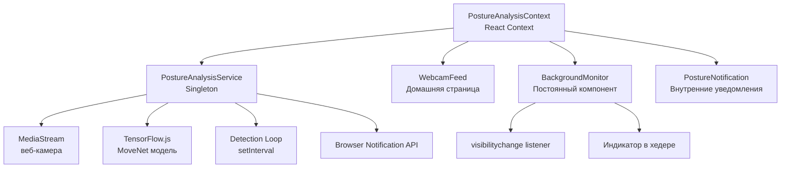
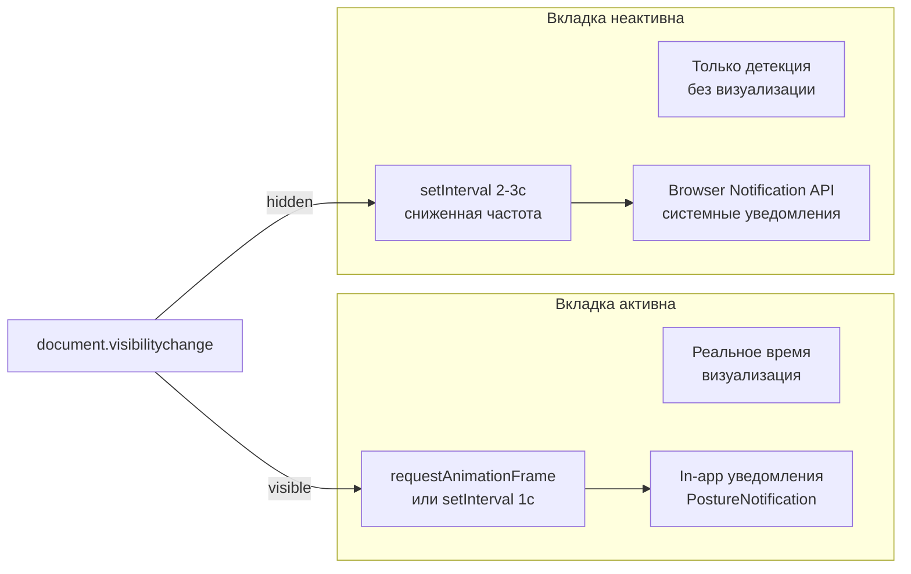

# План: Фоновый анализ осанки с системными уведомлениями

## 1. Проблема

Сейчас анализ осанки работает только когда пользователь находится на странице [`Home.tsx`](frontend/src/pages/home/Home.tsx). При уходе на другую страницу внутри SPA или на другой сайт (вкладка браузера):

- Компонент [`WebcamFeed`](frontend/src/components/home/WebcamFeed.tsx) размонтируется
- Поток с веб-камеры останавливается
- Модель TensorFlow.js уничтожается
- Уведомления не показываются

## 2. Архитектурное решение

### Основная идея: Вынести движок анализа из React-компонента в singleton-сервис

Создать слой сервиса, который живёт вне React-компонентов и управляет:
- Потоком веб-камеры (`MediaStream`)
- Моделью TensorFlow.js / MoveNet
- Циклом детекции
- Системными уведомлениями (через `Notification API`)

А React-компоненты (через Context) будут лишь подписываться на состояние этого сервиса.



### Почему именно такой подход?

| Подход | Проблемы |
|--------|----------|
| Service Worker | Нет доступа к `getUserMedia` и WebGL |
| Web Worker | Нет доступа к `getUserMedia` |
| Hidden iframe/popup | Проблемы с блокировщиками всплывающих окон |
| **Singleton-сервис + Context** ✅ | Работает во всех браузерах, поток камеры живёт всё время |

## 3. План реализации

### Этап 1: Создать `PostureAnalysisService` (singleton-сервис)

**Файл:** [`frontend/src/services/postureAnalysisService.ts`](frontend/src/services/postureAnalysisService.ts)

**Что делает:**
- Управляет потоком веб-камеры (`getUserMedia`)
- Загружает и хранит модель TensorFlow.js/MoveNet
- Запускает/останавливает цикл детекции
- Хранит эталонную позу (калибровка)
- Анализирует отклонения от эталона
- Управляет кулдауном уведомлений
- Использует `setInterval` вместо `requestAnimationFrame` (rAF тормозится в фоновых вкладках)
- Отправляет browser-уведомления (`new Notification()`) когда вкладка неактивна

**Интерфейс:**
- `start(settings?)` — запуск с веб-камерой
- `stop()` — остановка, освобождение ресурсов
- `calibrate()` — установка эталонной позы
- `resetCalibration()` — сброс эталона
- `setDetectionInterval(ms)` — настройка частоты анализа
- `addListener(callback)` — подписка на события (статус, нарушения)
- `removeListener(callback)` — отписка
- `isRunning`, `isCalibrated`, `currentStatus`, `trackingQuality` — геттеры состояния

**События (через listeners):**
- `statusChange` — изменение статуса осанки
- `postureIssue` — обнаружено нарушение (с типом и severity)
- `trackingQualityChange` — изменение качества отслеживания
- `calibrationChange` — изменение калибровки
- `error` — ошибка

### Этап 2: Создать `PostureAnalysisProvider` (React Context)

**Файл:** [`frontend/src/contexts/PostureAnalysisContext.tsx`](frontend/src/contexts/PostureAnalysisContext.tsx)

**Что делает:**
- Инициализирует `PostureAnalysisService` при монтировании
- Подписывается на события сервиса и обновляет React-состояние
- Предоставляет хуки для компонентов
- Следит за `document.visibilityState` для переключения режимов

**Хуки:**
- `usePostureAnalysis()` — получение всех данных о состоянии анализа
- `usePostureControl()` — получение методов управления (start/stop/calibrate)

### Этап 3: Обновить `App.tsx`

**Изменения:**
- Добавить `PostureAnalysisProvider` на уровень выше `<Routes>`
- Убрать ленивую загрузку `TrayManager` (если он будет нужен глобально)
- Добавить `BackgroundMonitor` — постоянный компонент для системных уведомлений

```tsx
function App() {
  return (
    <ThemeProvider>
      <Router>
        <PostureAnalysisProvider>
          <div className="App">
            <Header />
            <BackgroundMonitor /> {/* Невидимый, но живущий постоянно */}
            <main>
              <Routes>...</Routes>
            </main>
          </div>
        </PostureAnalysisProvider>
      </Router>
    </ThemeProvider>
  );
}
```

### Этап 4: Создать `BackgroundMonitor` (постоянный компонент)

**Файл:** [`frontend/src/components/system/BackgroundMonitor.tsx`](frontend/src/components/system/BackgroundMonitor.tsx)

**Что делает:**
- Не имеет визуального UI (может показывать маленький индикатор)
- Следит за `document.visibilityState`
- Когда вкладка неактивна: шлёт browser-уведомления через `Notification API`
- Когда вкладка активна: полагается на in-app уведомления
- Может воспроизводить звуковой сигнал при критических нарушениях

**Логика уведомлений:**
```
document.visibilityState === 'hidden' && нарушение обнаружено
    → new Notification('Posture Analyzer', { body: '...', tag: 'posture-alert' })
    
document.visibilityState === 'visible' 
    → Показываем PostureNotification внутри React
```

### Этап 5: Рефакторинг `WebcamFeed.tsx`

**Изменения:**
- Убрать локальное управление моделью TensorFlow.js и детекцией
- Использовать `usePostureAnalysis()` для получения данных
- Использовать `usePostureControl()` для управления
- Оставить только отображение веб-камеры и UI кнопок
- Синхронизировать с `useSessionManager`

**Схема изменений:**
```diff
- const detectorRef = useRef<poseDetection.PoseDetector | null>(null);
- const modelInitRef = useRef(false);
- const lastDetectionTimeRef = useRef(0);
- const [isModelLoading, setIsModelLoading] = useState(false);
- const [referenceNormalized, setReferenceNormalized] = useState(null);
- const [isModelReady, setIsModelReady] = useState(false);
- const [trackingQuality, setTrackingQuality] = useState(0);
- const [currentPoseStatus, setCurrentPoseStatus] = useState('...');
- const [currentIssues, setCurrentIssues] = useState([]);
+ const { 
+   isRunning, isCalibrated, isModelLoading, 
+   currentStatus, issues, trackingQuality,
+   sessionStats
+ } = usePostureAnalysis();
+ 
+ const { start, stop, calibrate, resetCalibration } = usePostureControl();
```

### Этап 6: Обновить `TrayManager.tsx`

**Изменения:**
- Заменить демо-логику с `setInterval` на реальные данные из `PostureAnalysisService`
- Показывать реальный статус мониторинга
- Убрать фейковые уведомления
- Интегрировать с сервисом для реальных alert'ов

### Этап 7: Настройка Service Worker для PUSH-уведомлений (опционально)

Если нужны уведомления даже когда браузер закрыт:
- Добавить Service Worker
- Настроить Push API (требуется бэкенд с Web Push)

## 4. Детальная логика фонового анализа

### Переключение режимов по видимости вкладки



### Управление потоком камеры

- Веб-камера включается при `start()` и НЕ выключается при переходе на другую страницу
- При полном закрытии вкладки/браузера — поток автоматически прекращается
- Если пользователь хочет остановить — вызывает `stop()`

### Стратегия уведомлений

| Состояние | Тип уведомления | Механизм |
|-----------|----------------|----------|
| Пользователь на сайте, вкладка активна | In-app | `PostureNotification` (React) |
| Пользователь на другой вкладке браузера | Системное | `new Notification()` |
| Пользователь в другом приложении (браузер свёрнут) | Системное | `new Notification()` |
| Браузер закрыт | (Опционально) | Push API через Service Worker |

## 5. Файлы, которые будут созданы

| Файл | Назначение |
|------|-----------|
| [`frontend/src/services/postureAnalysisService.ts`](frontend/src/services/postureAnalysisService.ts) | Singleton-сервис анализа осанки |
| [`frontend/src/contexts/PostureAnalysisContext.tsx`](frontend/src/contexts/PostureAnalysisContext.tsx) | React Context Provider + хуки |
| [`frontend/src/components/system/BackgroundMonitor.tsx`](frontend/src/components/system/BackgroundMonitor.tsx) | Постоянный фоновый монитор |

## 6. Файлы, которые будут изменены

| Файл | Изменения |
|------|-----------|
| [`frontend/src/App.tsx`](frontend/src/App.tsx) | Добавить PostureAnalysisProvider + BackgroundMonitor |
| [`frontend/src/components/home/WebcamFeed.tsx`](frontend/src/components/home/WebcamFeed.tsx) | Убрать локальное управление моделью, использовать сервис |
| [`frontend/src/components/system/TrayManager.tsx`](frontend/src/components/system/TrayManager.tsx) | Интегрировать с реальным сервисом |
| [`frontend/src/components/ui/PostureNotification.tsx`](frontend/src/components/ui/PostureNotification.tsx) | Минимальные изменения для работы с сервисом |
| [`frontend/src/assets/styles/system/TrayManager.css`](frontend/src/assets/styles/system/TrayManager.css) | Стили для фонового монитора |
| [`frontend/src/assets/styles/home/WebcamFeed.css`](frontend/src/assets/styles/home/WebcamFeed.css) | Небольшие изменения (если нужны) |

## 7. Границы и риски

### Что НЕ входит в этот план:
- Push-уведомления через Service Worker (закрытый браузер) — это отдельная задача
- Нативная десктопная интеграция (системный трей ОС) — это Electron/native
- Мобильная версия с фоновым режимом

### Риски:
- **Производительность**: TensorFlow.js потребляет батарею в фоновом режиме. Решение — снижать частоту детекции до 2-3 секунд, когда вкладка неактивна.
- **Ограничения браузеров**: Некоторые браузеры (Safari) могут приостанавливать `setInterval` в фоновых вкладках до ~1 раза в минуту. Решение — использовать `AudioContext` timer как fallback.
- **Разрешения**: `Notification.requestPermission()` должен быть вызван до отправки уведомлений.
